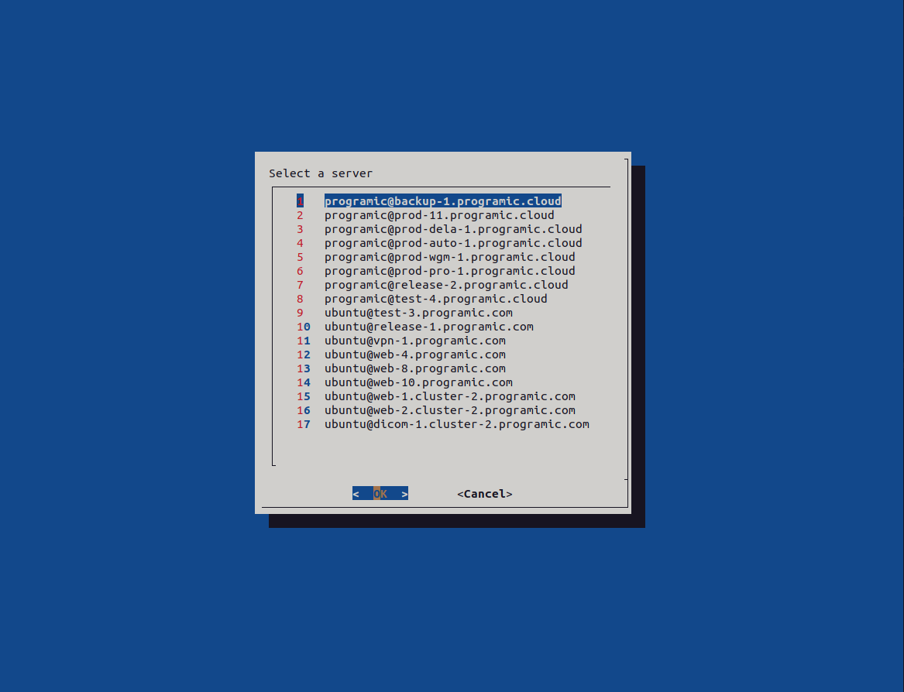

# 1. Docker local development environment

## To get started
1. Clone the [repository](https://bitbucket.org/programic/docker-devtools).
   ```bash
   git clone https://bitbucket.org/programic/docker-devtools
   cd docker-devtools
   ```
3. Create external networks
   ```bash
   docker network create web
   docker network create localstack
   ```
3. Start dev-tools:
   ```bash
   docker compose up -d
   ```
4. Add the bin folder to your $PATH
   ```bash
   # Bash as shell
   nano ~/.bashrc 
   
   # ZSH as shell
   nano ~/.zshrc
   
   # Add this to the bottom of this file, and change the path to your docker-devtools folder
   export PATH="${PATH}:/Users/remco/code/docker-devtools/bin"
   ```

### Trust the self-signed CA SSL certificate
1. Add it to your MacOS Keychain:
   ```bash
   sudo security add-trusted-cert -d -r trustRoot -k "/Library/Keychains/System.keychain" ./services/traefik/certs/output/programic-ca.crt
   ```
   for Ubuntu:
   ```bash
   sudo cp ./services/traefik/certs/output/programic-ca.crt /usr/local/share/ca-certificates
   sudo update-ca-certificates
   ```
2. Browser support:
   * Chrome: out of the box, except for Ubuntu. Chrome does not support system installed certificates anymore, 
   which is why .crt files in the Ubuntu filesystem will be recognized, but not accepted. After installing the files, 
   go to Chrome, `Settings` > `Privacy and Security` > `Security` > `Manage Certificates`. Add the output .crt files to
   to the tab `Servers`. They will then appear in the `Others` section.
   * Safari: out of the box
   * Firefox:
      * `about:config` > `security.enterprise_roots.enabled`: `true`
3. Other support:
   * curl: out of the box
   * Postman:
     * `Postman` > `Preference` > `Certificates`
       * CA Certificates: `ON`
       * PEM file: `./services/traefik/certs/output/programic-CA.pem`

### Installing the NrdSSH client (Alias `s`)


1. Installing the `dialog` package: Ubuntu `sudo apt install dialog`, MacOS `brew install dialog`
2. Open the NrdSSH client by running `s` in your terminal

## Access services
1. Traefik: [https://traefik.pro.test](https://traefik.pro.test)
2. Portainer: [https://portainer.pro.test](https://portainer.pro.test)
3. Jaeger: [https://jaeger.pro.test](https://jaeger.pro.test)
    
## How to renew the Programic developer certificate?
1. First build the Docker image to generate the Programic developer certificates. Navigate to `cd services/traefik/certs/docker` and run `bash build.sh`
2. Navigate to its parent directory `cd ..` and run the Docker image you just build: `bash generate.sh`
3. Done. The certificates are saved in the `output` directory. Commit your changes.

## Setup local S3 with LocalStack

1. Create a S3 bucket for your project:
   ```bash
   docker compose exec localstack awslocal s3api create-bucket --bucket [your-bucket-name]
   ```
2. Test the connection and check if the bucket has been created:
   ```bash
   docker run --rm -it --network localstack \
      -e AWS_ENDPOINT_URL=http://localstack:4566 \
      -e AWS_ACCESS_KEY_ID=test \
      -e AWS_SECRET_ACCESS_KEY=test \
      amazon/aws-cli \
      s3 ls
   ```
3. Edit the local `docker-compose.yml` file of your project:
   ```yml
   services:
       php:
           networks:
               localstack: # Add the container to the LocalStack network
       worker:
           networks:
               localstack: # Add the container to the LocalStack network
       scheduler:
           networks:
               localstack: # Add the container to the LocalStack network
   networks:
       localstack: # Define the LocalStack network
           external: true
   ```
4. Configure Laravel filesystem to connect to LocalStack S3:
   ```bash
   AWS_ENDPOINT=http://localstack:4566
   AWS_URL=https://localstack.pro.test
   AWS_ACCESS_KEY_ID=test
   AWS_SECRET_ACCESS_KEY=test
   AWS_DEFAULT_REGION=eu-central-1
   AWS_USE_PATH_STYLE_ENDPOINT=true
   AWS_BUCKET=[your-bucket-name]
   ```

# 2. Digital Ocean Spaces configuration
```bash
cd bin/do-spaces-config

docker run --rm -it \
   -e AWS_ENDPOINT_URL=https://ams3.digitaloceanspaces.com \
   -e AWS_ACCESS_KEY_ID=[your_access_key_id] \
   -e AWS_SECRET_ACCESS_KEY=[your_secret_access_key] \
   -e S3_BUCKET=[your_s3_bucket] \
   -v $(pwd):/aws \
   --entrypoint /bin/bash \
   amazon/aws-cli \
   enable-versioning.sh
```